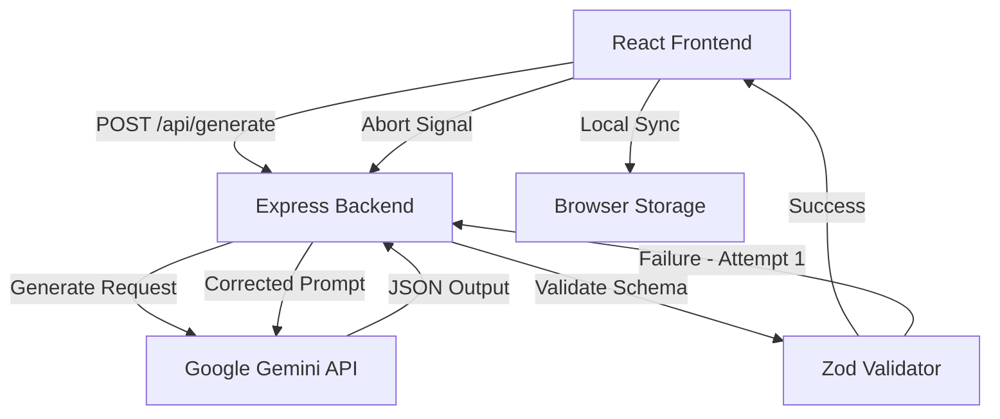

# MindSync AI Study Assistant

A production-quality AI Study Assistant application built using **React (Vite) + Tailwind CSS + Express + Gemini API**. The application analyzes your study notes, formats them into structured study resources, and creates interactive Flashcards and a Multiple-Choice Quiz.

---

## ⚡ Features
- **Notion/Linear Inspired UI**: Minimalist, clean workspace design with full dark mode support.
- **AI-Powered Assets**: Generates highly targeted Flashcards (with active recall layouts) and Quizzes (with score tracking, explanation popups, and incorrect-only retries).
- **Production-Grade API Client**:
  - Validates Gemini outputs with Zod schema verification.
  - Smart error handling with a automatic one-time retry system on malformed/invalid JSON formats.
  - Prevent stale responses and optimize server resources using native `AbortController` integration.
  - Secure credential storage (Gemini API keys are never exposed to the client).
- **Performance & Persistence**:
  - Saved session storage using `localStorage` with a searchable History panel to reload past sessions.
  - Zero-layout shifts and responsive mobile-first layouts.

---

## 🏗️ Architecture



### Tech Stack
- **Frontend**: React 19, Vite, Tailwind CSS, Framer Motion, Lucide Icons
- **Backend**: Node.js/Express, Zod, @google/generative-ai SDK, Helmet (CORS/security headers), Express Rate Limit

---

## 🚀 Setup & Installation

### Prerequisites
- Node.js (v18 or higher)
- A Gemini API Key (Obtain from [Google AI Studio](https://aistudio.google.com/))

### Steps

1. **Clone the Repository**:
   ```bash
   cd flam_study
   ```

2. **Configure Environment Variables**:
   In the `/server` directory, create a `.env` file from the template:
   ```bash
   cp server/.env.example server/.env
   ```
   Open the `.env` file and insert your Gemini API key:
   ```env
   GEMINI_API_KEY=your_actual_gemini_api_key
   PORT=5000
   ```

3. **Install Dependencies**:
   Install all dependencies for the workspace, client, and server at once:
   ```bash
   npm run install:all
   ```

4. **Start Development Servers**:
   Launch both the Express backend and Vite frontend concurrently:
   ```bash
   npm run dev
   ```
   - Frontend will run on: `http://localhost:5173`
   - Backend will run on: `http://localhost:5000`

---

## 🧠 AI Prompt Design
To optimize response speed, lower API token consumption, and ensure structural reliability, the backend uses a highly concise, system-instructed prompt containing a defined JSON schema template. The model is configured with:
- `responseMimeType: "application/json"` to force strict JSON parsing mode.
- Precise count limits (4-8 flashcards, 4-6 quiz questions) relative to input notes to keep the latency low and study aids compact.

---

## ⚠️ Limitations & Notes
1. **Gemini Rate Limits**: Standard free-tier Gemini API keys are subject to rate limiting (usually 15 RPM). The application has client-side loading limits and server-side `express-rate-limit` configuration (max 30 requests / 15 minutes per IP) to prevent hitting quota errors.
2. **Context Limits**: Large textbook chapters (e.g. 50+ pages) might exceed optimal token sizes or trigger timeouts. It is recommended to submit notes up to 10,000 words for the best response quality.
3. **Accuracy**: Like all Large Language Models, Gemini might occasionally hallucinate answers. The detailed explanations provided inside the quiz answers help users quickly verify facts.

---

## ⏱️ Time Spent & Effort Summary
- **Planning & Architecture**: ~30 mins
- **Backend Express Development & API Retries**: ~45 mins
- **UI Design & Tailwind Styling**: ~1 hour
- **Interactive Component Implementation (Flashcards, Quizzes, Stats)**: ~1 hour
- **Integration, Local Storage, & Verification**: ~30 mins
- **Total Development Time**: **~3 hours 45 mins**
